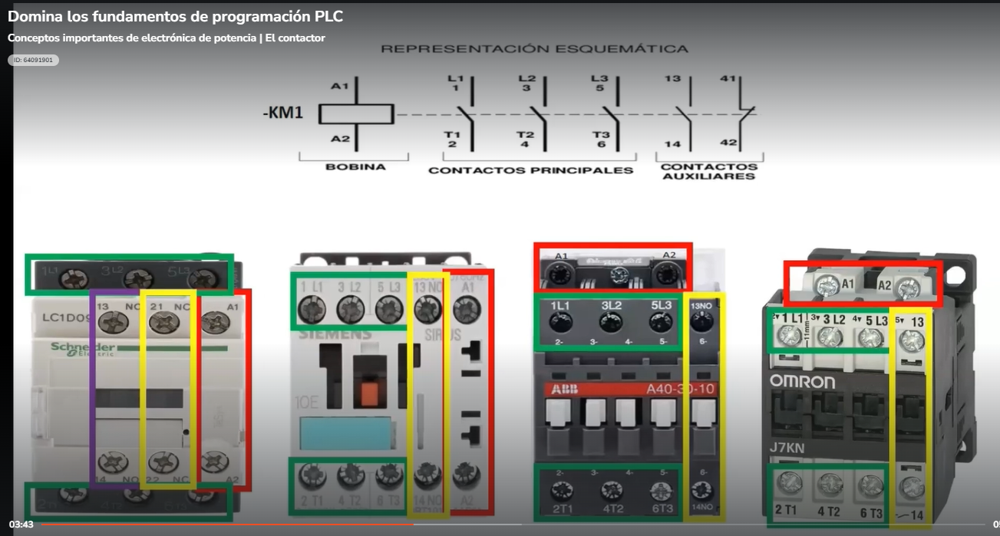
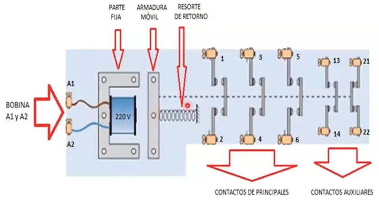
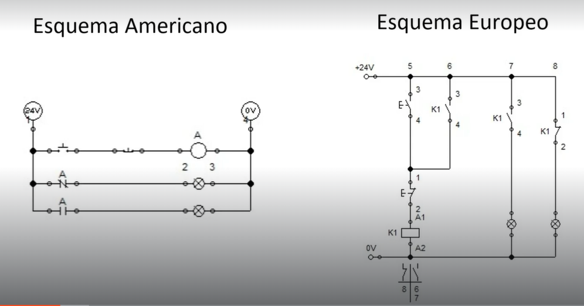
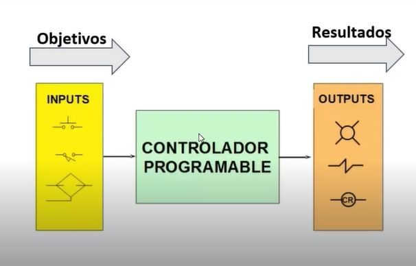
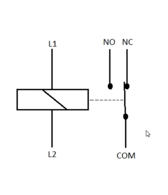

# FTALS_PLC
### FUNDAMENTALS OF PLC PROGRAMMING

    TIP
    Los seres humanos tenemos dos formas de aprender/retener información, la activa y pasiva.
    Leer, escuchar y  solo nos permite retener menos del 30% de la información después de varias semanas.
    Mientras que practicar/explicar/exponer permite retener hasta el 95%.

_______________________________________________

    

### Modulo 1 Introducción

    Notas importantes
    Obtendras una constancia de habilidades no una certificación.
    Todo lo que ese dentro de este esquema tiene validez [Documento]("https://www.gob.mx/sep/articulos/conoce-el-sistema-educativo-nacional#:~:text=Sistema%20Educativo%20Nacional-,El%20Sistema%20Educativo%20Nacional%20est%C3%A1%20compuesto%20por%20los%20tipos%3A%20B%C3%A1sico,niveles%20Preescolar%2C%20Primaria%20y%20Secundaria.")

    Comprueba tu validez de tus estudios [Registro Profesionistas](https://www.cedulaprofesional.sep.gob.mx/cedula/presidencia/indexAvanzada.action)

Este curso forma parte de una Maestria en Automatización de procesos industriales, en total 27 cursos que forman parte de 5 diplomados:

    - Habilidades gerenciales
    - Controladores Logicos Programables
    - Diseño de aditamentos de control y ensamble
    - Instalacion y mantenimiento de sistemas mecatronicos
    - Calidad industrial

### Modulo 2 Normalización
¿Que es la Normalización?
La normalización podemos entenderla como las normas o estandares definidos. 

Las normas nacen con la necesidad de medir, primero necesitamos medir de ahí nace el "Metro" y la pulgada.

En la revolución industrial (1760 - 1840) nacen las primeras normalizaciones con el telegrafo y con las vias del tren.

A finales de 1880 se reunen los mas grandes inventores de la epoca formando la ASME "Asociacion americana de ingenieros mecanicos" para compartir ideas y trabajar en equipo.

Entre 1870 a 1910 se registraron al menos 10,000 explociones por calderas, lo que desenboco en una manifestación de trabajadores.
Por lo que el gobierno de la época le pidio a la ASME que solucionara la situación.

De ahí nacio la primera norma vigente, la norma de calderas a presión, esto se deben seguir para mantener clas cuestiones de seguridad.

El segundo punto importante en la historia de la normalización sucedio en la primera guerra mundial, debido a que no embonaban las balas de las armas, este punto importante de la normalización para mantener la intecambiabilidad.

Por ello nace la DIN (1917) que a nivel ingeniería generaron normas de tipo general, de tipo tecnico, de materiales, de dimenciones de piezas y mecanismos y en ambitos de aplicación.

También se creo la Institución britanica de estandarización (1919) la Asociación francesa de normalización (1918) y e instituto japonés de estandarización (1921).

Pero esto no nos aseguraba la compatibilidad entre las diferentes normas de los paises.

Después de la segunda guerra mundial se firman varios tratados y entre ellos nace la

    ¿Por que es importante la Normalización?
    Las normas nos permiten mantener seguridad, permitiendo disminuir los errores, fallas, accidentes, intercambialidad y calidad.

la ISO "international organization for Standardization" en ginebra despues de la segunda guerra mundial(1947) con 3 objetivos calidad, medio ambiente y seguridad, llegó como una alternativa para lograr la compatibilidad de todas las medidas permitiendo que los paises trabajen mutuamente, aliniando a todoslos paises.

Muchos paises aceptaron usar esta estandarización mientras que los americanos prefirieron crear sus propias normas esto por los conflicto internacionales y creó la ANSI "American National Standards Institute" creada a partir de la ASME tomando muchas cosas de ella. 

##### Clasificación de Normas
    
    Cada empresa puede crear sus propias normas que utilizaran en sus actividades mientras cada una sujeta a la superior.

    De empresa -> Nacionales -> Internacionales

Por ejemplo para lo planos electricos tenemos dos esquemas diferentes
    
    Esquema Americano y el esquema europeo Europeo

¿Que normas debemos seguir en nuestra empresa?

Si en nuestros procesos es necesario seguir reglas especificas, que por empresa sea necesario crear normas, esto es necesario indudablemente, sin embargo estas deben estar alineadas a las normas ISO.

Por que es necesario aprender el esquema americano, esto debido a que el primer PLC se desarrollo con este sistema, sin embargo podemos encontrar mas circuitos con el esquema europeo.

#### Evaluación Módulo 2

    [Modulo 2](/cuestionario/modulo_2.md)

### Modulo 3
#### Conceptos importantes de electrónica de potencia
##### El contactor

Es un interruptor de accionamiento electromagnético, diseñado para efectuar maniobras de apertura y cierre en circuitos de alto consumo de corriente..

Arranque motores trifasicos, control de hornos, velocidad de motores, etc.

Estos comunmente cuentan con los siguientes borners:
    
    Borners de potencia
        - Contactos principales
            - Borners 1,3,5 se conectan a la fuente trifasica (verde)
            - Borners 2,4,6 se conecta un relé térmico y luego el motor (Verde)
        - Contactos Auxiliares
            - Contacto normal abierto (morado)
            - Contacto normal cerrado (amarillo)
        - Bobina (rojo)

**Contactor AC3 recomendaco para cargas inductivas como los motores electricos**

##### Principio de funcionamiento

Cuando se energiza la bobina se accionan os contactos, abriendo los contactos cerrados y cerrando los contactos abiertos.

Cuando deja de llegar corriente a la bobina los contactos vuelven a su estado de reposo.

##### Teoría básica de control electrico

Para la parte de la industria de la automatización es necesario conocer los planos, existen dos esquemas que másnos econtrameron son el esquema Americano y el Esquema Europeo.

Trabajaremos con el esquema americano ya que fue con este con el que se basó la programación PLC.

El PLC surge en estados unidos, GM solicito aun equipo de investigadores que crearan algo para hacer mas eficiente el control de sus equipos, una de las empecificacioes de GM fue que usaran los esquemas que ya conician. Se termino normalizando este esquema.

###### ¿Para que nos son utiles estos diagramas?

Para hacer un sistema de control.

El PLC que está en el centro va a realizar la lógica para que en base a nuestras entradas nos otorgue los resultados que busquemos.

    Por ejemplo un termostato, su sensor detecta la temperatura actual y esta entrada puede activar el sistema de enfriamiento.

Lista de elementos electricos mas usados: 
[Simbologia.pdf](./documentacion/Simbologia.pdf)

Comenzando con el elemento electrico mas utilizado para ver las diferencias entre los diferentes esquemas DIN, ANSI, y el IEC, que son los principales.

    - El esquema ANSI es del sistema Americano.

    - El esquema DIN es del sistema Aleman. Recordemos que este sigue el ISO.

    - El esquema IEC (Comite internacional de electrotecnia) es del sistema Internacional. Es similitud a ISO pero en electricidad.

###### EL BOTON

El botón lo podemos encontrar en dos diferentes tipos, botón normalmente abierto y el botón normalmente cerrado.

###### EL CONTACTO

Tenemos dos definiciones

En la primera el contacto se encuetra normalmente abierto (NA), el circuito se encuentra interrumpido mientras en el segundo el contacto normalmente cerrado (NC) donde si hay contacto.

###### EL RELEVADOR

Un relevador contiene una bobina interna que al aplicarle un voltaje, lo convierte en un campo electromagnetico, esto para mover el inducido de hierro dulce a su vez permitiendo que el contacto que se encontraba abierto se cierre.
Siendo un interruptor para controlar corrientes mucho mas altas

###### Reelevadores con retardo a la resconección

En esta gráfica observamos la tensión en la bobina con respecto al tiempo. En el contacto de nuestra bobina de abre al meterle energía, pero después quitarle la energia retarda para desconectarse.

De igual manera al meterle corriente este tarda un tiempo en cerrar el circuito despues de meterle el voltaje.

###### Simbologia de las Bobinas

###### Contactores

Su funcionamiento es muy similar a los relevadores pero es mas inductrial.

Existen dos tipod de contactores:

    - Los contactos principales:
        Entre 4 y 30kW, la conmutación esta a cargo de contactos principales (disyuntores)

    - Contactos auxiliares:
        Se utilizan para las funciones de control y enlaces lógicos se activan mediante contactos auxiliares.

Su ventaja es que podemos tener varios contactos conectados

.png)

###### Diagrama Europeo de Fuerza y Mando

La diferencia entre la fuerza y el mando.

La fuerza es la parte que se encargara de realizar el trabajo, mientras mando va a realizar la logica de control 

Vistos de manera mas práctica, esta seria la conexion.

**Diferencias**

| Fuerza | Mando |
| --- | --- |
|Alto voltaje y corriente |Poco voltaje y corriente|
|Corriente alterna|Corriente directa|
|Actuadores| Sensores|
|Cableado grueso|Cableado delgado|

##### 2. Lógica de relés

